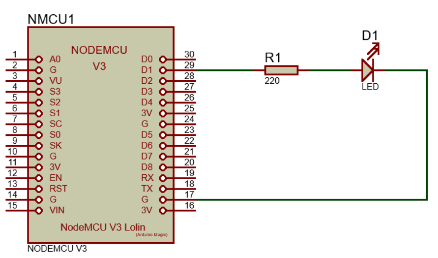
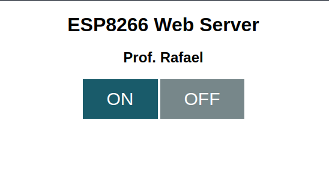

# Projeto I

### Servidor Web 

O projeto vissa o controle de uma porta digital por meio do navegador Web.

Seguindo o circuito a seguir:

Tela

> O programa inicia o servidor no ESP8266 na porta 80 (porta padrão para comunicações HTTP)

> Definindo várias rotas (endpoints) que o servidor web pode lidar. Cada rota está associada a uma função específica que é chamada quando é acessada:

* Quando alguém acessa a raiz do servidor (por exemplo, acessando http://192.168.1.169/ no navegador), a função handleRoot é chamada. Esta função envia uma página HTML para o cliente, que contém botões e scripts para controlar o LED.

* "/5/on": Quando esta rota é acessada, a função handleOn é chamada, que liga o LED (definido no pino 5, que corresponde ao pino GPIO 5 no ESP8266 (D1)) e envia uma resposta para o cliente informando que o LED foi ligado.

* "/5/off": Similarmente, quando esta rota é acessada, a função handleOff é chamada, que desliga o LED e envia uma resposta informando que o LED foi desligado.

> Loop Principal: No loop principal do programa, server.handleClient() é chamado repetidamente. Esta é uma função de escuta que faz o servidor processar as solicitações de entrada, chamando os manipuladores de rota apropriados conforme descrito acima.